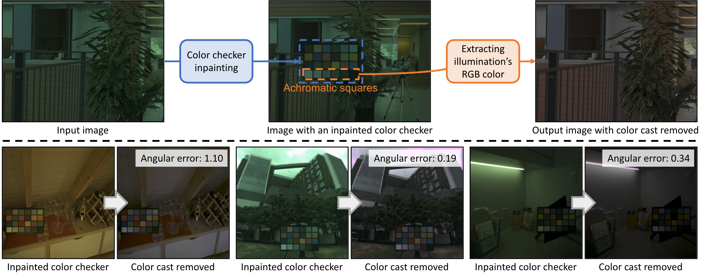

<div align="center">

# [CVPR 2025] GCC: Generative Color Constancy via Diffusing a Color Checker

</div>

<div align="center">

🚀 [Paper](https://arxiv.org/abs/2502.17435) | 
🏠  [Project Page](https://chenwei891213.github.io/GCC/) 

</div>



# 🛠️ Installation

**Reference**: This installation setup is adapted from [DiffusionLight](https://github.com/DiffusionLight/DiffusionLight).

To setup the Python environment, you need to run the following commands in both Conda and pip:

```bash
conda env create -f environment.yml
conda activate diffusionlight
pip install -r requirements.txt
```

# 🔧 Data Preprocessing

Processes black level (darkness level) and saturation level correction for color constancy datasets. Extracts and saves metadata in JSON format with illuminant information.

**Pre-processed datasets are available for download: [Link](https://example.com/preprocessed_datasets.zip)**

## Supported Datasets

- [NUS-8 Dataset](http://cvil.eecs.yorku.ca/projects/public_html/illuminant/illuminant.html)
- [Gehler-Shi Dataset](https://www2.cs.sfu.ca/~colour/data/shi_gehler/)

## Dataset Format

### NUS-8 Dataset
```
dataset_root/
├── Camera1DsMkIII/
│   ├── PNG/
│   │   └── *.png
│   └── ground_truth/
│       └── Camera1DsMkIII_gt.mat
├── Canon600D/
│   ├── PNG/
│   │   └── *.png
│   └── ground_truth/
│       └── Canon600D_gt.mat
└── ... (other cameras)
```

### Gehler Dataset
```
dataset_root/
├── images/
│   └── *.png
├── coordinates/
│   └── *_macbeth.txt
└── ground_truth.mat
```

## Usage

To preprocess the datasets

```bash
# NUS-8 Dataset
python process_dataset.py \
    --dataset_type NUS8 \
    --dataset_root /path/to/nus8_dataset \
    --output_root /path/to/processed_nus8

# Gehler Dataset  
python process_dataset.py \
    --dataset_type Gehler \
    --dataset_root /path/to/gehler_dataset \
    --output_root /path/to/processed_gehler
```

## Output Structure

```
output_root/
├── images/        # Processed data
├── mask/          # Binary masks for ColorChecker locations
└── all_cameras_meta.json   # Metadata for all processed images
```
# 🔥 Training

Fine-tunes Stable Diffusion 2 inpainting model for color constancy tasks.

## Usage

```bash
export MODEL_NAME="stabilityai/stable-diffusion-2-inpainting"

# Cross-dataset setting: train on NUS8 dataset (for later testing on Gehler)
accelerate launch --gpu_ids 0 train.py \
  --pretrained_model_name_or_path=$MODEL_NAME \
  --resolution=512 \
  --train_batch_size=8 \
  --gradient_accumulation_steps=2 \
  --max_train_steps=20000 \
  --learning_rate=5e-05 \
  --output_dir="/path/to/output" \
  --train_data_dir="/path/to/processed_nus8" \
  --cache_dir="/path/to/cache" \
  --val_image_folder="/path/to/validation"
  --dataset="nus8" \                    # Dataset type: "nus8" or "gehler"
  --fold='all' \                        # Use all available data


# Leave-one-camera-out: train excluding SonyA57, test on SonyA57
accelerate launch --gpu_ids 0 train.py \
  [base arguments...] \
  --camera_name='SonyA57' \             # Specific camera to exclude
  --fold='exclude'                      # Exclude the specified camera

# 3-fold cross validation: train on Canon1D folds 1,2, test on fold 0
accelerate launch --gpu_ids 0 train.py \
  [base arguments...] \
  --camera_name='Canon1D' \             # Specific camera for CV
  --fold=0                              # Test fold (train on folds 1,2)
```
You can directly use the training scripts provided in the `scripts/` folder (modify the paths before running):

```bash
bash scripts/train_all_dataset.sh
bash scripts/train_leave_one_out.sh
```

# 🎯 Inference

Evaluates trained models on preprocessed datasets and calculates angular error statistics.

**Pre-trained model checkpoints are available for download: [Link](https://example.com/pretrained_models.zip)**

## Usage

```bash

# Cross-dataset: evaluate NUS8 using model trained on Gehler
python inference.py \
    --dataset_type nus8 \               # Target dataset for evaluation
    --camera_name all \                 # Cross-dataset evaluation
    --fold all \                        # Use all target dataset
    --dataset_dir /path/to/processed_nus8 \
    --metadata_path /path/to/processed_nus8/all_cameras_meta.json \
    --model_path /path/to/gehler_trained_model \
    --color_checker_path /path/to/color_checker.png \
    --cache_dir /path/to/cache \
    --output_dir /path/to/results \
    --batch_size 20
# → Output: eval_nus8_from_gehler.json

# Leave-one-camera-out: evaluate SonyA57 using model trained excluding SonyA57
python inference.py \
    --dataset_type nus8 \
    --camera_name SonyA57 \             # Camera to evaluate (was excluded in training)
    --fold exclude \                    # Matches leave-one-camera-out training
    --dataset_dir /path/to/processed_nus8 \
    --metadata_path /path/to/processed_nus8/all_cameras_meta.json \
    --model_path /path/to/nus8_exclude_SonyA57_model \
    --color_checker_path /path/to/color_checker.png \
    --cache_dir /path/to/cache \
    --output_dir /path/to/results \
    --batch_size 20
# → Output: nus8_train_exclude_SonyA57_test_SonyA57.json

# 3-fold cross validation: evaluate Canon1D fold 0 using model trained on folds 1,2
python inference.py \
    --dataset_type nus8 \               # Dataset to evaluate on
    --camera_name SonyA57 \             # Specific camera to evaluate
    --fold 0 \                          # Test fold (matches training setup)
    --dataset_dir /path/to/processed_nus8 \
    --metadata_path /path/to/processed_nus8/all_cameras_meta.json \
    --model_path /path/to/trained_model \
    --color_checker_path /path/to/color_checker.png \
    --cache_dir /path/to/cache \
    --output_dir /path/to/results \
    --batch_size 20
# → Output: nus8_train_fold12_test_fold0_SonyA57.json
```
You can directly use the inference scripts provided in the `scripts/` folder (modify the paths before running):

```bash
bash scripts/inference_all_dataset.sh
bash scripts/inference_leave_one_out.sh
```

# 📊 Evaluation

Combines results from multiple experiments and calculates comprehensive angular error statistics. Can be used for leave-one-camera-out evaluation, three-fold cross-validation, or analyzing single experiment results.

```bash
# Analyze result files in a directory (supports single or multiple JSON files)
python combine.py \
    --folder_path /path/to/results
```

**Output:**
```
Found 8 JSON files
Successfully processed 1736 images
Mean: 2.15
Median: 1.78
Tri-mean: 1.92
Best 25% (mean): 0.84
Worst 25% (mean): 4.67
```

# 📝 Citation

```bibtex
@misc{chang2025gccgenerativecolorconstancy,
      title={GCC: Generative Color Constancy via Diffusing a Color Checker}, 
      author={Chen-Wei Chang and Cheng-De Fan and Chia-Che Chang and Yi-Chen Lo and Yu-Chee Tseng and Jiun-Long Huang and Yu-Lun Liu},
      year={2025},
      eprint={2502.17435},
      archivePrefix={arXiv},
      primaryClass={cs.CV},
      url={https://arxiv.org/abs/2502.17435}, 
}
```